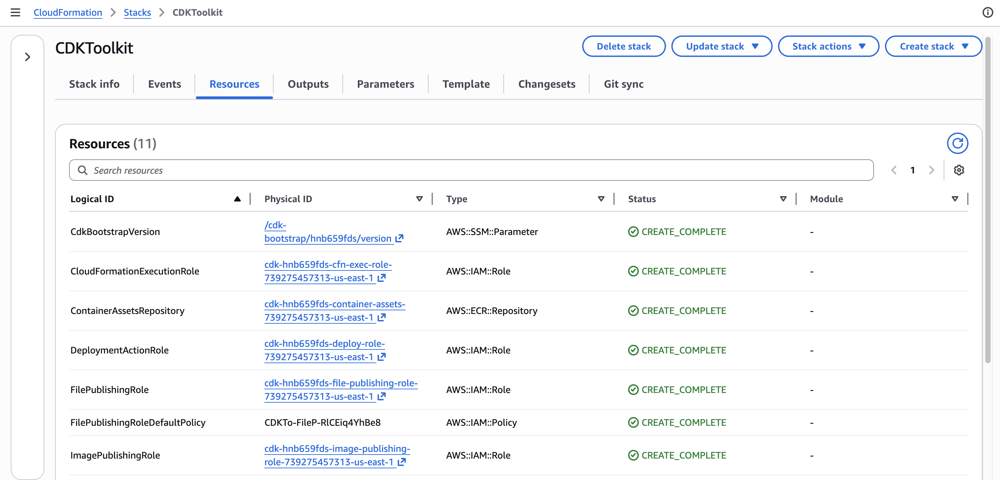
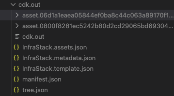
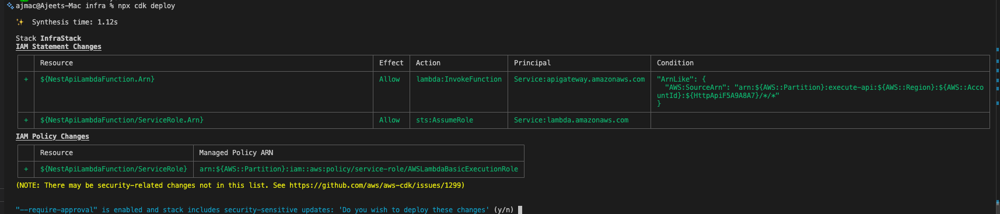
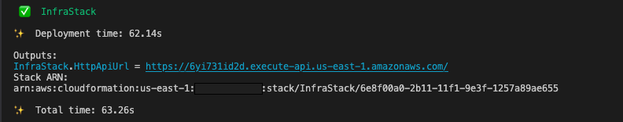
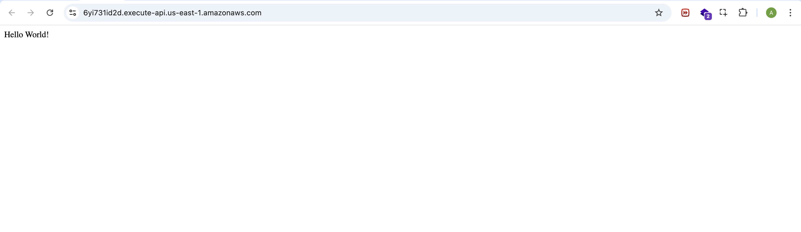
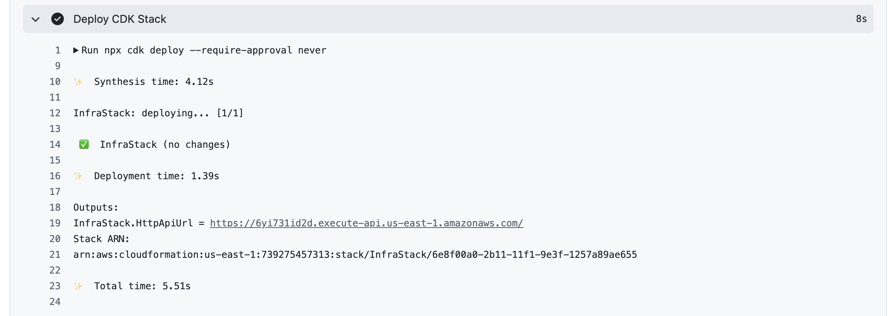

Deploying a NestJS application to AWS Lambda behind API Gateway sounds straightforward — until you actually try to wire everything together.

Between adapting NestJS to a serverless runtime, configuring API Gateway, and setting up infrastructure with AWS CDK, there are several moving parts that can quickly become painful.While working on a personal side project, I ran into these challenges firsthand — especially when making NestJS compatible with Lambda's execution model.

In this guide, you'll learn how to deploy a NestJS application to AWS Lambda using AWS CDK, with deployments fully automated via GitHub Actions.

The complete source code for this project, including the NestJS application and AWS CDK infrastructure, is available on [Github](https://github.com/ajeetchaulagain/nestjs-serverless-aws-lambda-cdk)

## What you will learn

- How to adapt a NestJS application to run in AWS Lambda
- How to define and manage infrastructure using AWS CDK
- Packaging application code and dependencies for Lambda
- How API Gateway routes requests to your application
- Deploying and validating your stack locally
- Automating deployments using GitHub Actions

## Prerequisites

This guide walks through deploying a sample NestJS application to AWS Lambda using CDK and GitHub Actions.

To follow along, you'll need:

- An AWS account
- Basic familiarity with Node.js and NestJS
- Basic familiarity with AWS services and tools (AWS CLI, IAM, Lambda, API Gateway, CloudFormation)
- A GitHub account (for setting up GitHub Actions)

<InfoCallToAction htmlString="<p>You don't need deep AWS expertise to follow along, but having a rough idea of how IAM, Lambda, and API Gateway fit together will make things easier.</p>"/>

## Set up a new NestJS project

Start by creating a new NestJS application using the Nest CLI:

```bash
npm i -g @nestjs/cli
nest new nestjs-serverless-aws-cdk
```

This scaffolds a standard NestJS project with all the necessary boilerplate.

For a deeper understanding of NestJS concepts and architecture, I highly recommend to checkout [NestJS official documentation](https://docs.nestjs.com/).

Now, start the application:

```bash
cd nestjs-serverless-aws-cdk
npm run start
```

You should see the application running at [http://localhost:3000/](http://localhost:3000/). The default port is configured in `src/main.ts`:

```ts:title=src/main.ts
import { NestFactory } from '@nestjs/core';
import { AppModule } from './app.module';

async function bootstrap() {
  const app = await NestFactory.create(AppModule);
  await app.listen(process.env.PORT ?? 3000);
}
bootstrap();
```

The scaffolded project already includes:

- A controller (`app.controller.ts`)
- A service (`app.service.ts`)
- A module (`app.module.ts`)

Since the focus of this guide is deployment, we'll reuse the default endpoint instead of creating new ones.

## Adapting NestJS for AWS Lambda

By default, a NestJS application runs on a long-lived HTTP server. It bootstraps once, initializes its dependencies, and continues handling incoming requests.

AWS Lambda, on the other hand, follows an _event-driven model_ where code is executed per request in short-lived, stateless environments (with occasional cold starts).

Because of this difference, NestJS cannot run directly in Lambda without some adaptation.To bridge this gap, we use `@codegenie/serverless-express`, which allows a NestJS application to run inside AWS Lambda.

Under the hood, it:

- Converts the incoming Lambda event into an HTTP request
- Passes it to your NestJS application
- Transforms the response back into a Lambda-compatible format

In simple terms, it makes Lambda behave like an HTTP server so NestJS can run without major changes.

Now that we understand the need for additional configuration, let's install the required packages:

```bash
npm install @codegenie/serverless-express aws-lambda
```

Note: `aws-lambda` provides the TypeScript types used in the handler.

Next, create a new file called `lambda.ts` inside the `src/` directory (alongside `main.ts`). This will act as the entry point for your Lambda function.

```ts:title=src/lambda.ts {numberLines:true}
import { NestFactory } from '@nestjs/core';
import { ExpressAdapter } from '@nestjs/platform-express';
import serverlessExpress from '@codegenie/serverless-express';
import {
  APIGatewayProxyEvent,
  APIGatewayProxyResult,
  Context,
} from 'aws-lambda';
import express from 'express';
import { AppModule } from './app.module';

type AsyncHandler = (
  event: APIGatewayProxyEvent,
  context: Context,
) => Promise<APIGatewayProxyResult>;

let serverlessExpressInstance: AsyncHandler | undefined;

async function setup(
  event: APIGatewayProxyEvent,
  context: Context,
): Promise<APIGatewayProxyResult> {
  const expressApp = express();
  const nestApp = await NestFactory.create(
    AppModule,
    new ExpressAdapter(expressApp),
  );

  nestApp.enableCors();
  await nestApp.init();

  serverlessExpressInstance = serverlessExpress({
    app: expressApp,
  }) as unknown as AsyncHandler;

  return serverlessExpressInstance(event, context);
}

export function handler(
  event: APIGatewayProxyEvent,
  context: Context,
): Promise<APIGatewayProxyResult> {
  if (serverlessExpressInstance) {
    return serverlessExpressInstance(event, context);
  }

  return setup(event, context);
}
```

A few key things worth calling out in the code above:

- `serverlessExpressInstance` variable is declared outside the handler and only populated on the first invocation. On subsequent invocations within the same Lambda container, the `if (serverlessExpressInstance)` check skips the full NestJS bootstrap and reuses the existing instance. This is the standard pattern for reducing cold start overhead in Lambda.
- `setup` function is where NestJS bootstraps. It creates an Express app, wraps it with the NestJS `ExpressAdapter`, and passes it to `serverlessExpress`. The resulting instance is a function that accepts Lambda events and returns Lambda-compatible responses.

<InfoCallToAction htmlString="<p>This handler follows the standard async/await pattern and works with modern AWS Lambda Node.js runtimes (including Node.js 20 and 24).</p><p>The AWS Lambda Node.js 24 runtime dropped support for the callback-style handler (<code>callback(null, response)</code>) — using it will cause the function to hang until timeout. See the <a href='https://docs.aws.amazon.com/lambda/latest/dg/lambda-nodejs.html'>AWS Lambda Node.js runtime docs</a> for details.</p>"/>

## Setting up infrastructure using AWS CDK

Now that we have the Lambda handler ready to serve our NestJS application, let's set up the infrastructure using AWS CDK. AWS Cloud Development Kit (CDK) is an Infrastructure as Code (IaC) framework that allows you to define AWS resources using programming languages such as TypeScript, Python, Java, and more. Think of it like this: instead of writing raw CloudFormation templates, you write code that is synthesized into CloudFormation, which is then used to deploy resources to AWS.

The high-level CDK flow looks something like this:

```bash:noCopy
👨‍💻 Write CDK Code
        ↓
🧪 cdk synth
        ↓
📄 CloudFormation Template
        ↓
🚀 cdk deploy
        ↓
☁️ AWS Resources
```

In practice, CDK makes infrastructure easier to reason about and maintain compared to raw templates.

### CDK mental model (quick overview)

Before we define our infrastructure, it helps to understand a few core CDK concepts:

- **App** → The root container for your CDK application
- **Stack** → A unit of deployment (maps to a CloudFormation stack)
- **Construct** → Building blocks used to define AWS resources

In this guide, we'll define a single stack that provisions our Lambda function, API Gateway, and related resources.

### Initializing CDK in the project

Now that you've understood the basics of AWS CDK, let's initialize it in our project. To keep the infrastructure code separate from the NestJS source code, you'll initialize the CDK project into a separate subdirectory, `infra/`.

Run the following command from the project root:

```bash
mkdir infra && cd infra
npx cdk init app --language typescript
```

This generates the basic CDK project structure:

```bash:title=Directory_Structure&noCopy
.
├── bin/
├── lib/
├── cdk.json
├── package.json
└── tsconfig.json
```

Where:

- `bin/` contains the entry point of your CDK app
- `lib/` contains the stack definition for your infrastructure
- `cdk.json` contains configuration for the CDK CLI

### Configuring AWS credentials (step by step)

Before running any AWS CDK commands, you need to configure AWS credentials on your local machine.

This allows AWS to authenticate your requests and perform actions on your behalf — such as deploying CloudFormation stacks and uploading assets.

For example, when you run:

```bash
npx cdk bootstrap
```

Your IAM identity needs permissions to create foundational resources like:

- CloudFormation stacks
- S3 buckets (for storing assets)
- IAM roles and policies

<InfoCallToAction htmlString="<p>In production environments, it's best to follow the <strong>principle of least privilege</strong>, granting only the permissions required for a specific task.</p><p>However, to keep this guide simple and focused, we'll use an IAM user with the <strong><code>AdministratorAccess</code></strong> policy attached.</p>"/>

Follow these steps to configure AWS credentials:

#### 1. Install AWS CLI

Make sure AWS CLI is installed on your machine. Follow the official installation guide [here](https://docs.aws.amazon.com/cli/latest/userguide/getting-started-install.html).

#### 2. Create an IAM user with Administrator Access and generate an access key

1. Log in to your AWS console
2. Navigate to IAM → Users → Create User
3. Create a user (e.g., `cdk-bootstrap-admin`)
   - Attach the **AdministratorAccess** policy
   - Generate an **access key**

<VideoPlayer src="/aws-create-user-secret-access.mp4" caption="Shows creating IAM user and creating access token" />

Make sure to download the secret key for use later — you won't be able to view it again.

#### 3. Run AWS Configure

Run `aws configure` to set up credentials for the AWS CLI so it can authenticate your requests:

```bash
aws configure
```

You'll be prompted to enter:

```bash:noCopy
AWS Access Key ID:
AWS Secret Access Key:
Default region name: us-east-1
Default output format: json
```

Paste the access keys you generated in the previous step.

#### 4. Verify credentials configuration

To confirm AWS credentials are configured correctly, run the following AWS CLI command, which will show the details of your AWS account and IAM user:

```bash
aws sts get-caller-identity
```

```json:title=Output
{
  "UserId": "UserId",
  "Account": "AccountNumber",
  "Arn": "arn:aws:iam::<AccountNumber>:user/cdk-bootstrap-admin"
}
```

### Bootstrapping the CDK project

Now that your AWS credentials are configured locally, you're ready to bootstrap your AWS environment for CDK.

Bootstrapping prepares your AWS account so that AWS CDK can deploy resources on your behalf.

Run the following command in your `infra/` directory:

```bash
npx cdk bootstrap
```

This command creates a foundational one-time CloudFormation stack (called `CDKToolkit`) in your AWS account, which sets up required resources such as IAM roles and an S3 bucket to upload CloudFormation templates. These resources are needed for future CDK deployments.



<InfoCallToAction htmlString="<p>You only need to run <code>cdk bootstrap</code> once per account and region.</p>"/>

### Writing the CDK stack

Now that you've bootstrapped your environment, you're ready to define your infrastructure using AWS CDK. In this section, you'll create a stack that provisions a Lambda function for your application.

I'm also using a Lambda layer to bundle production dependencies. Separating `node_modules` from the application code helps reduce the size of the deployment package and allows the same layer to be reused across multiple Lambda functions.

Navigate to the `infra/lib` directory, where you'll find a file named `infra-stack.ts`. This file was generated during CDK project initialization. You can rename the stack if needed, but for this guide, we'll keep it as is.

Add the following stack definition code to `infra/lib/infra-stack.ts`:

```ts:title=infra/lib/infra-stack.ts {3-6,12-37}{numberLines:true}
import * as cdk from 'aws-cdk-lib/core';
import { Construct } from 'constructs';
import * as lambda from 'aws-cdk-lib/aws-lambda';
import * as apigwv2 from 'aws-cdk-lib/aws-apigatewayv2';
import * as integrations from 'aws-cdk-lib/aws-apigatewayv2-integrations';
import * as path from 'path';

export class InfraStack extends cdk.Stack {
  constructor(scope: Construct, id: string, props?: cdk.StackProps) {
    super(scope, id, props);

    const nodeModulesLayer = new lambda.LayerVersion(this, 'NodeModulesLayer', {
      code: lambda.Code.fromAsset(path.join(__dirname, '../../layer')),
      compatibleRuntimes: [lambda.Runtime.NODEJS_24_X],
      description: 'Production node_modules for NestJS Lambda',
    });

    const nestApiLambda = new lambda.Function(this, 'NestApiLambdaFunction', {
      runtime: lambda.Runtime.NODEJS_24_X,
      handler: 'src/lambda.handler',
      code: lambda.Code.fromAsset(path.join(__dirname, '../../dist'), {
        exclude: ['infra', 'tsconfig*'],
      }),
      memorySize: 512,
      layers: [nodeModulesLayer],
    });

    const httpApi = new apigwv2.HttpApi(this, 'HttpApi', {
      defaultIntegration: new integrations.HttpLambdaIntegration(
        'LambdaIntegration',
        nestApiLambda,
      ),
    });

    new cdk.CfnOutput(this, 'HttpApiUrl', {
      value: httpApi.url!,
    });
  }
}
```

In this setup, you're using a few core CDK constructs to define your infrastructure:

- `lambda.Function`
- `lambda.LayerVersion`
- `apigwv2.HttpApi`

In CDK, constructs are the basic building blocks used to model infrastructure. If you haven't come across constructs before, the official docs are worth a quick read: [https://docs.aws.amazon.com/cdk/v2/guide/constructs.html](https://docs.aws.amazon.com/cdk/v2/guide/constructs.html).

Now let's go through the different configuration parts in the code above.

### Lambda layer configuration

```ts
const nodeModulesLayer = new lambda.LayerVersion(this, 'NodeModulesLayer', {
  code: lambda.Code.fromAsset(path.join(__dirname, '../../layer')),
  compatibleRuntimes: [lambda.Runtime.NODEJS_24_X],
  description: 'Production node_modules for NestJS Lambda',
});
```

This code defines a Lambda layer using the `LayerVersion` construct, where the code is loaded from a `layer/` directory, which doesn't exist yet.

To create it, add the following script to your root `package.json`:

```json
"build:lambda-layer": "mkdir -p layer/nodejs && cp package.json package-lock.json layer/nodejs/ && npm ci --prefix layer/nodejs --omit=dev && rm layer/nodejs/package.json layer/nodejs/package-lock.json"
```

Since we don't need dev dependencies for our Lambda runtime, this script installs only production dependencies into `layer/nodejs/`. In short, it copies the existing `package.json` and lock file into `layer/nodejs/` temporarily and installs production dependencies (`npm ci --omit=dev`) that our application needs.

Now, run that script from the project root to create a `/layer` directory (we'll need this before deploying):

```bash
npm run build:lambda-layer
```

Also add `/layer/nodejs/node_modules` to your `.gitignore`. This directory should be generated during builds, not committed.

#### Lambda function configuration

```ts
const nestApiLambda = new lambda.Function(this, 'NestApiLambdaFunction', {
  runtime: lambda.Runtime.NODEJS_24_X,
  handler: 'src/lambda.handler',
  code: lambda.Code.fromAsset(path.join(__dirname, '../../dist'), {
    exclude: ['infra', 'tsconfig*'],
  }),
  memorySize: 512,
  layers: [nodeModulesLayer],
});
```

This code defines our Lambda function along with some configuration. Here's a breakdown of the key settings:

- `runtime: lambda.Runtime.NODEJS_24_X` : sets Node.js v24 as the runtime used by the Lambda function
- `handler: 'src/lambda.handler'` — the entry point Lambda invokes. We created this handler previously in `src/lambda.ts`. Since the application is deployed from the `dist` directory which contains a `src` folder, the handler is defined as `src/lambda.handler`.
- `code: lambda.Code.fromAsset(…)` — packages the compiled application (`dist/`) and uploads it as the deployment bundle
- `exclude: […]` — skips unnecessary files from the bundle. I would strongly recommend being intentional here — smaller bundles lead to faster deployments. For example, I've excluded the `infra` directory and `tsconfig*` related files present in our `dist` directory. The only files needed for the NestJS runtime are in `dist/src`.
- `memorySize: 512` — allocates 512 MB of memory to our Lambda runtime. NestJS has a heavier bootstrap compared to minimal handlers, so this tends to give better performance out of the box. Without `memorySize`, it defaults to 128 MB.
- `layers` — attaches the layer defined above. This layer is merged into the function's filesystem at runtime.

### HTTP API Gateway configuration

```ts
const httpApi = new apigwv2.HttpApi(this, 'HttpApi', {
  defaultIntegration: new integrations.HttpLambdaIntegration(
    'LambdaIntegration',
    nestApiLambda
  ),
});
```

Here you define an HTTP API using _API Gateway v2_. This guide uses HTTP API (v2), which is cheaper than REST API (v1), has lower latency, and is sufficient for NestJS since routing lives inside the application. See the [official comparison](https://docs.aws.amazon.com/apigateway/latest/developerguide/http-api-vs-rest.html) if you need the advanced features REST API offers.

This uses `HttpLambdaIntegration`, which enables [Lambda proxy integration](https://docs.aws.amazon.com/apigateway/latest/developerguide/http-api-develop-integrations-lambda.html). In simple terms, any incoming HTTP requests to API Gateway are forwarded to your Lambda as an event, and the response from Lambda is forwarded back to the client unchanged.

By setting this as the default integration, CDK creates a `$default` route — a catch-all that matches any HTTP method and any path. This is an important consideration for our NestJS application because we want the routing to happen inside the application itself, not at the API Gateway level.

### CloudFormation outputs

```ts
new cdk.CfnOutput(this, 'HttpApiUrl', {
  value: httpApi.url!,
});
```

This prints the generated endpoint URL to the terminal after running `cdk deploy`. Something like this:

```bash:noCopy
Outputs:
InfraStack.HttpApiUrl = https://abc123.execute-api.us-east-1.amazonaws.com/
Stack ARN:
arn:aws:cloudformation:us-east-1:<account-number>:stack/InfraStack/a0fb4130-2a7f-11f1-ab1d-12c493467933
```

## Deploying the infrastructure

At this point, your infrastructure is defined. Now it's time to deploy it.

### Deploying locally

Before running the `cdk deploy` command, let's first validate the CloudFormation stack by running `cdk synth` from the `infra/` directory:

```bash
cd infra && npx cdk synth
```

This compiles your CDK code and generates the CloudFormation template in the `infra/cdk.out/` directory. It's a quick way to catch configuration issues before running a full deployment.



Once synthesis succeeds, make sure your `tsconfig.build.json` excludes the `infra/` directory and explicitly sets `rootDir`:

```json:title=tsconfig.build.json
{
  "extends": "./tsconfig.json",
  "compilerOptions": {
    "rootDir": "./"
  },
  "exclude": ["node_modules", "test", "dist", "infra", "**/*spec.ts"]
}
```

Two things are happening here:

- **Excluding `infra/`** — without this, `nest build` will try to compile your CDK code as part of the application. Since CDK dependencies like `aws-cdk-lib` are installed inside `infra/node_modules` (not at the project root), the build will fail with module resolution errors.
- **Setting `rootDir`** — controls the output folder structure. Without it set explicitly, TypeScript figures it out from whichever files are included. Once `infra/` is excluded, TypeScript only sees `src/` and uses that as the root — so `lambda.ts` compiles to `dist/lambda.js` instead of `dist/src/lambda.js`, which no longer matches the handler path you defined in the stack.

Now build your application (`dist/`) and Lambda layer (`layer/`) from the project root:

```bash
npm run build
npm run build:lambda-layer
```

This ensures your compiled application and production dependencies are ready for deployment.

Now run the deploy command from the `infra/` directory:

```bash
npx cdk deploy
```

This starts the CDK deployment process. You'll see a summary of IAM and resource changes before it proceeds.



Confirm the deployment when prompted. After a successful deploy, you'll see the API URL in the terminal output.



Hit this URL and you should see the "Hello World!" response from your `app.controller.ts` endpoint.



### Deploying with GitHub Actions

So far, you've been deploying locally using `cdk deploy`. That works well for development, but in a production-grade setup, you'll want deployments to run through CI.

A common approach is to trigger deployments automatically when changes are pushed to the main branch. In this section, we'll keep things simple and use GitHub Actions to automate deployments on every push to `main`. I won't walk through the workflow line by line — the goal here is to get a working setup in place.

If you're new to GitHub Actions, the official docs are a good place to start: [https://docs.github.com/en/actions](https://docs.github.com/en/actions).

Add the following file `.github/workflows/deploy.yml`:

```yaml:title=.github/workflows/deploy.yml
name: Deploy

on:
  push:
    branches:
      - main
jobs:
  deploy:
    runs-on: ubuntu-latest

    steps:
      - name: Checkout
        uses: actions/checkout@v4.2.2

      - name: Set up Node.js
        uses: actions/setup-node@v4.4.0
        with:
          node-version: 24
          cache: 'npm'

      - name: Install dependencies
        run: npm ci

      - name: Build application
        run: npm run build

      - name: Build Lambda layer
        run: npm run build:lambda-layer

      - name: Configure AWS credentials
        uses: aws-actions/configure-aws-credentials@v4.1.0
        with:
          aws-access-key-id: ${{ secrets.AWS_ACCESS_KEY_ID }}
          aws-secret-access-key: ${{ secrets.AWS_SECRET_ACCESS_KEY }}
          aws-region: ${{ vars.AWS_REGION }}

      - name: Install CDK dependencies
        run: npm ci
        working-directory: infra

      - name: Deploy CDK Stack
        run: npx cdk deploy --require-approval never
        working-directory: infra
```

At a high level, this workflow:

- Installs dependencies
- Builds the application (`dist/`) and Lambda layer (`/layer`)
- Configures AWS credentials for CI
- Deploys the CDK stack

**AWS credentials for CI**

If you see the workflow code, you see it uses GitHub **secrets** and **variables** to authenticate with AWS:

- `AWS_ACCESS_KEY_ID` // stored as a secret
- `AWS_SECRET_ACCESS_KEY` // stored as a secret
- `AWS_REGION` // stored as a variable

Make sure you add these in your repository settings. You can follow the official guides:

- Creating repository secrets: [https://docs.github.com/en/actions/how-tos/write-workflows/choose-what-workflows-do/use-secrets](https://docs.github.com/en/actions/how-tos/write-workflows/choose-what-workflows-do/use-secrets)
- Creating repository variables: [https://docs.github.com/en/actions/how-tos/write-workflows/choose-what-workflows-do/use-variables](https://docs.github.com/en/actions/how-tos/write-workflows/choose-what-workflows-do/use-variables)

**Note:** GitHub masks secret values in logs, so outputs like your API URL (which includes the region) will also be masked and won't be directly clickable. Using `vars` for `AWS_REGION` keeps the output readable and ensures the endpoint URL is visible and usable, while sensitive values remain stored in secrets.

Once everything is in place, push your changes (including the workflow file) to the `main` branch. This will trigger the deployment automatically.

You can monitor the workflow from the **Actions** tab in your repository.

After the workflow completes, open the workflow run and check the **Deploy CDK Stack** step — the `HttpApiUrl` will be printed there without the region being masked.



## Conclusion

That's the full setup. If you've made it this far, you have a production-ready baseline for running NestJS on AWS Lambda.

You adapted NestJS to fit Lambda's execution model, defined your infrastructure as code using CDK, exposed it through API Gateway, and automated deployments with GitHub Actions. None of these pieces are complex on their own — but together they give you a setup that's consistent, repeatable, and easy to extend.

A few things this setup gets right out of the box:

- Infrastructure is version-controlled alongside your application code
- Deployments are automated and reproducible across environments
- NestJS runs in Lambda without changes to your routing or application logic — the gateway proxies everything through and NestJS handles it internally

From here, you can layer in things like custom domains, environment-specific stacks, and IAM-based authentication on the API Gateway as your requirements grow.

Thanks for following along — enjoy the serverless!
