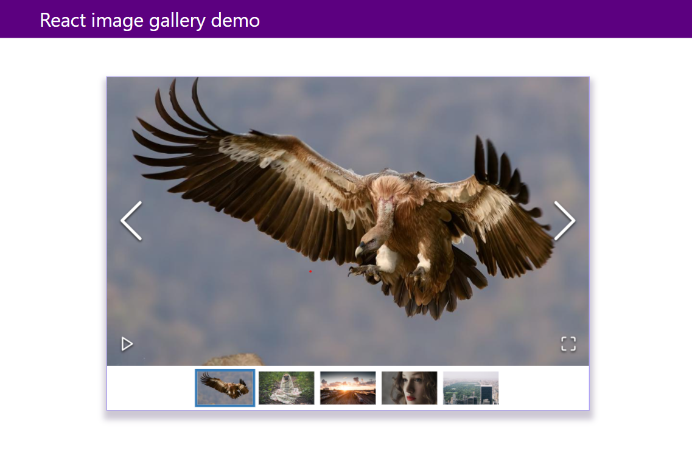
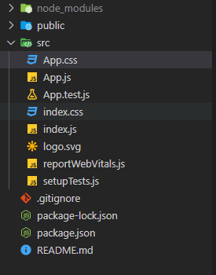
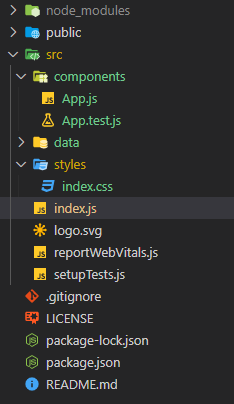
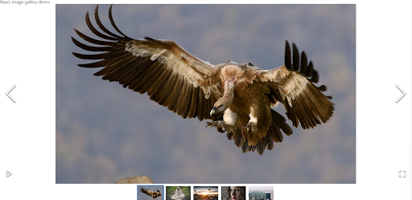

import { QuickInfo } from "../components/utilities/quick-info.tsx"

Suppose you are creating apps or web pages. In that case, you might need an image gallery to share the multiple images on our webpage with the best user interactions possible for the targeted audience. However, creating an image library from scratch that provides a great user experience for to end user requires quite an effort. In this tutorial, we will learn how to use different APIs of the react-image-gallery npm package to create a beautiful and elegant image gallery for your need with minimal effort.

_Screenshot of final application:_



## Why react-image-gallery ?

React image gallery is one of the most popular and community-loved npm packages for providing react components to _build highly customizable_ image galleries. Its popularity among consumers is due to its support for a wide range of features out of the box. These features include _swipe gestures for mobile devices, navigation through thumbnails, responsive design, and much more_. Moreover, the react component provided by the package is highly customizable through different props that will help almost all your job get done as a need of gallery in your project. In this tutorial, we will demonstrate the most used props that will be handy for our project.

- [Source code](https://github.com/ajeetchaulagain/react-image-gallery-demo) of the final application.

## Installation and Initial Setup

As the _react-image-gallery_ package provides the react component to build image galleries, we need a react project setup. In this tutorial, I will be choosing [create-react-app](https://www.npmjs.com/package/create-react-app) CLI to scaffold the react project for us as it comes with everything you need to build a React app pre-configured.

To set up a react project through create-react-app, run the following code in your terminal.

```bash
npx create-react-app react-image-gallery-demo
```

Once the project is created, _cd_ to the newly created directory and start the project.

```bash
cd react-image-gallery-demo && npm start
```

Running the above command will open the new app in localhost:3000

### Directory and imports cleanup

The react app setup through create-react-app will have all the working files placed in a single directory src. The initial directory structure is something like this:



To keep things organized, I will do a minor cleanup of the above initial directory structure and for non-required resources. The final directory would be something like this:



- _components_ directory will contain all our react components.
- _data_ directory will contain data that need to feed in react-image-gallery
- _styles_ directory will contain all our CSS stylesheets.

To achieve the above cleanup:

1. Remove _app.css_ file as we don’t need the most of the origins stylings and remove its reference from App.js file.
2. Delete _logo.svg_ and remove its import in _App.js_ file
3. Move _App.js_ and _App.test.js_ in src directory to the components directory
4. Move _index.css_ to styles directory
5. Update imports for _index.css_ and* App.js* files in _index.js_ file

### Adding CSS reset file

To avoid browser default stylings for different HTML elements, I would like to add a CSS reset code provided by https://meyerweb.com/eric/tools/css/reset/. To add the CSS reset code in the project, copy and paste the code provided by above url, to a new file called _css-reset.css_ in _styles_ directory. And reference that newly created file in _index.css_ which acts as our entry point for all the CSS:

```css
@import './css-reset.css';
```

These minimal CSS reset codes will avoid inconsistent stylings between different browsers.

## Installing and configuring react-image-gallery

After a minor cleanup is done for the project, to install the react-image-gallery run the following command in your terminal in your project directory.

```bash
npm i react-image-gallery
```

Please note, react-image-gallery requires a react version 16.0.0 or later as per the docs. After installing the package, import the stylesheet required for a package on top of index.css file

```css
@import '~react-image-gallery/styles/css/image-gallery.css';
```

The package has a default export called ImageGallery that has items props for providing a list of images we want to display in our gallery. Let's prepare a dummy image data for that by creating a gallery-image.ts file that have a list of images exported.

```j{numberLines:true}
export const images = [
  {
    original: 'https://picsum.photos/id/1024/1000/600/',
    thumbnail: 'https://picsum.photos/id/1024/250/150/',
  },
  {
    original: 'https://picsum.photos/id/1025/1000/600/',
    thumbnail: 'https://picsum.photos/id/1025/250/150/',
  },
  {
    original: 'https://picsum.photos/id/1026/1000/600/',
    thumbnail: 'https://picsum.photos/id/1026/250/150/',
  },
  {
    original: 'https://picsum.photos/id/1027/1000/600/',
    thumbnail: 'https://picsum.photos/id/1027/250/150/',
  },
  {
    original: 'https://picsum.photos/id/1029/1000/600/',
    thumbnail: 'https://picsum.photos/id/1029/250/150/',
  },
];
```

<QuickInfo url="https://picsum.photos/" name="picsum.photos"> provides the placeholder image with the advanced usage. It supports various query params in the request URL to get the image you need.
</QuickInfo>

Once data is prepared, we will import the ImageGallery component exported by the package and images we just prepared in App.js file and use it through items props. The App.js file will end up with something like this:

```javascript{numberLines:true}
import ImageGallery from 'react-image-gallery';
import { images } from '../data/gallery-image';

function App() {
  return (
    <div className="app">
      <header>
        <div className="header-wrapper">
          <h1>React image gallery demo</h1>
        </div>
      </header>
      <div className="image-gallery-wrapper">
        <ImageGallery items={images} />
      </div>
    </div>
  );
}

export default App;
```

_Note_: I have amended some change in JSX part of the App component to assist CSS styling later.

Now if you view the browser, you will see a beautiful image gallery rendered for us, something like this:



Currently, the ImageGallery is rendered full width in its container. Add the following CSS code in the _index.css_ file to give it a nice feel.

```css{numberLines:true}
header {
  background-color: #5c0080;
  margin-bottom: 4rem;
}

.header-wrapper {
  max-width: 1024px;
  margin: 0 auto;
  display: flex;
  padding: 1rem 0;
  color: #ffffff;
}

.header-wrapper h1 {
  font-size: 2rem;
}

.image-gallery-wrapper {
  margin-top: 5rem;
  max-width: 800px;
  width: 100%;
  margin: 0 auto;
  border: 1px solid rgb(146, 129, 242);
  box-shadow: #2b15453d 1px 10px 10px 5px;
}

@media only screen and (min-device-width: 375px) {
  .header-wrapper {
    padding: 1rem;
  }
}
```

As you can see, In the above code, we are adding some styles to the wrapper of the image gallery and the navigation bar. After this style is in place, you will have a beautiful image gallery displayed like this in the browser:


Yahoo! We made beautiful and responsive image galleries. You can view the demo for this app at -

## Customizing React image gallery

We already made the beautiful image gallery, without configuring any props and relying on the defaults. We can provide custom value to different props supported by packages for customizing as per needs.

Let's get started discussing a few of the common props that might be handy.
