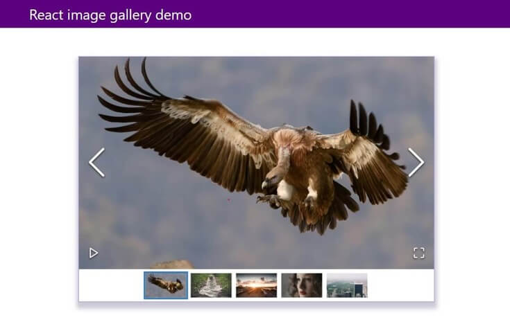
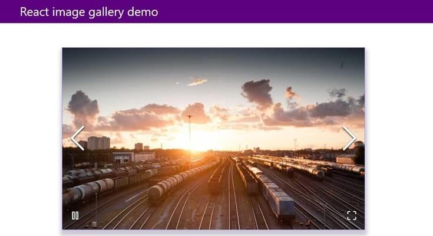

import { InfoCallToAction } from "../components/info-call-to-action/InfoCallToAction.tsx"

If you are creating web pages, you might need an image gallery showing multiple images at some point. However, developing an image gallery from scratch is quite an effort as you need to consider several things, such as user experience, customizability, and probably more features support. But a community-loved React package, [react-image-gallery,](https://www.npmjs.com/package/react-image-gallery) will help you develop a beautiful image gallery with a wide range of [features and customizability](https://github.com/xiaolin/react-image-gallery#user-content-features)

React image gallery is one of the [most popular npm package](https://npmtrends.com/react-gallery-swiper-vs-react-grid-gallery-vs-react-image-gallery-vs-react-image-lightbox-vs-react-image-slider-vs-react-images) that provide React component to build highly customizable image galleries. Also, It supports a wide range of features out of the box. These features include swipe gestures for mobile devices, navigation through thumbnails, responsive design, and much more. In this tutorial, you will learn how to build a _beautiful and elegant image gallery_ using a react-image-gallery npm package. Let's get started.

_Screenshot of final application:_



Here is the final source code and demo of the app:

- [View Source code on Github](https://github.com/ajeetchaulagain/react-image-gallery-demo)
- [View project demo](https://react-image-gallery-demo.ajeetchaulagain.com/)

## Installation and Initial Setup

As the _react-image-gallery_ package provides the React component to build image galleries, you need a react project setup. In this tutorial, I will be choosing [create-react-app](https://www.npmjs.com/package/create-react-app) CLI to scaffold the React project for us as it comes with everything you need to build a React app pre-configured.

To set up a React project through create-react-app, run the following code in your terminal.

```bash
npx create-react-app react-image-gallery-demo
```

Once the project is created, _cd_ to the newly created directory and start the project.

```bash
cd react-image-gallery-demo && npm start
```

Running the above command will open the new app in _localhost:3000_

### Clean up to create an image gallery

The React app setup through create-react-app will have all the working files placed in a single directory src. The initial directory structure is something like this:


To keep things organized, Let's do a minor cleanup of the initial directory structure for non-required resources. The final directory would be something like this:


- _components_ directory will contain all our React components.
- _data_ directory will contain data that need to feed in react-image-gallery
- _styles_ directory will contain all our CSS stylesheets.

To achieve the above cleanup:

1. Remove _app.css_ file as we don’t need the most of the origins stylings and remove its reference from App.js file.
2. Delete _logo.svg_ and remove its import in _App.js_ file
3. Move _App.js_ and _App.test.js_ in src directory to the components directory
4. Move _index.css_ to styles directory
5. Update imports for _index.css_ and* App.js* files in _index.js_ file

### Adding CSS reset file

To avoid browser default stylings for different HTML elements, you will add a CSS reset code provided by https://meyerweb.com/eric/tools/css/reset/. To add the CSS reset code to the project, copy and paste the above code to a new file called _css-reset.css_ in the _styles_ directory. And reference that newly created file in _index.css_, which acts as our entry point for all the CSS:

```css
@import './css-reset.css';
```

These minimal CSS reset codes will avoid inconsistent stylings between different browsers.

## Installing and configuring react-image-gallery

After a minor cleanup is done for the project, to install the react-image-gallery run the following command in your terminal in your project directory.

```bash
npm i react-image-gallery
```

<InfoCallToAction htmlString="<p>react-image-gallery requires a React version 16.0.0 or later as per the docs.</p>"/>

After installing the package, you need to import the stylesheet required for a package on top of _index.css_ file.

```css
@import '~react-image-gallery/styles/css/image-gallery.css';
```

The package has a default export called ImageGallery that has items props for providing a list of images we want to display in our gallery. Let's prepare a dummy image data for that by creating a _gallery-image.ts_ file that have a list of images exported.

```j{numberLines:true}
export const images = [
  {
    original: 'https://picsum.photos/id/1024/1000/600/',
    thumbnail: 'https://picsum.photos/id/1024/250/150/',
  },
  {
    original: 'https://picsum.photos/id/1025/1000/600/',
    thumbnail: 'https://picsum.photos/id/1025/250/150/',
  },
  {
    original: 'https://picsum.photos/id/1026/1000/600/',
    thumbnail: 'https://picsum.photos/id/1026/250/150/',
  },
  {
    original: 'https://picsum.photos/id/1027/1000/600/',
    thumbnail: 'https://picsum.photos/id/1027/250/150/',
  },
  {
    original: 'https://picsum.photos/id/1029/1000/600/',
    thumbnail: 'https://picsum.photos/id/1029/250/150/',
  },
];
```

<InfoCallToAction htmlString="<p><a href='picsum.photos'>picsum.photos</a> provides the placeholder image with the advanced usage. It supports various query params in the request URL to get the image you need.</p>"/>

Once data is prepared, you will import the ImageGallery component exported by the package and images you just prepared in App.js file and use it through items props. The _App.js_ file will end up with something like this:

```jsx{numberLines:true}
import ImageGallery from 'react-image-gallery';
import { images } from '../data/gallery-image';

function App() {
  return (
    <div className="app">
      <header>
        <div className="header-wrapper">
          <h1>React image gallery demo</h1>
        </div>
      </header>
      <div className="image-gallery-wrapper">
        <ImageGallery items={images} />
      </div>
    </div>
  );
}

export default App;
```

_Note_: I have amended some change in JSX part of the App component to assist CSS styling later.

Now if you view the browser, you will see a beautiful image gallery rendered for us, something like this:


Currently, the ImageGallery is rendered full width in its container. Add the following CSS code in the _index.css_ file to give it a nice feel.

```css{numberLines:true}
header {
  background-color: #5c0080;
  margin-bottom: 4rem;
}

.header-wrapper {
  max-width: 1024px;
  margin: 0 auto;
  display: flex;
  padding: 1rem 0;
  color: #ffffff;
}

.header-wrapper h1 {
  font-size: 2rem;
}

.image-gallery-wrapper {
  margin-top: 5rem;
  max-width: 800px;
  width: 100%;
  margin: 0 auto;
  border: 1px solid rgb(146, 129, 242);
  box-shadow: #2b15453d 1px 10px 10px 5px;
}

@media only screen and (min-device-width: 375px) {
  .header-wrapper {
    padding: 1rem;
  }
}
```

As you can see, In the above code, we are adding some styles to the wrapper of the image gallery and the navigation bar. After this style is in place, you will have a beautiful image gallery displayed in the browser:


Yahoo! You now made a beautiful and responsive image gallery. You can view the demo for this app [here](https://github.com/ajeetchaulagain/react-image-gallery-demo)

## Customizing React image gallery

As you can see above, you made a beautiful image gallery without configuring any props and relying on the defaults. You can also provide custom value to different props supported by packages for customizing as per needs. The [documentation for react-image-gallery](https://github.com/xiaolin/react-image-gallery#user-content-props) package is decent, and I suggest checking it out for a wide range of possible configurations.

For example, suppose you want your gallery to be auto-played and don't want thumbnails to display. In that case, you can pass _autoPlay_ props to _true_ and showThumbnails props to _false_ in an ImageGallery component.

```js
<ImageGallery items={images} autoPlay={true} showThumbnails={false} />
```

This is how it looks with above props in place:



## Conclusion

This tutorial gives you a basic idea of leveraging third-party modules like react-image-gallery to build an image gallery with minimal effort. I hope you enjoyed this article about using the react-image-gallery package through this step-by-step guide.

- [View Source code on Github](https://github.com/ajeetchaulagain/react-image-gallery-demo)
- [View Project Demo](https://react-image-gallery-demo.ajeetchaulagain.com/)
- [React Image Gallery npm package](https://www.npmjs.com/package/react-image-gallery)
- Icons made by [Freepik](https://www.freepik.com) from [www.flaticon.com](https://www.flaticon.com/)
