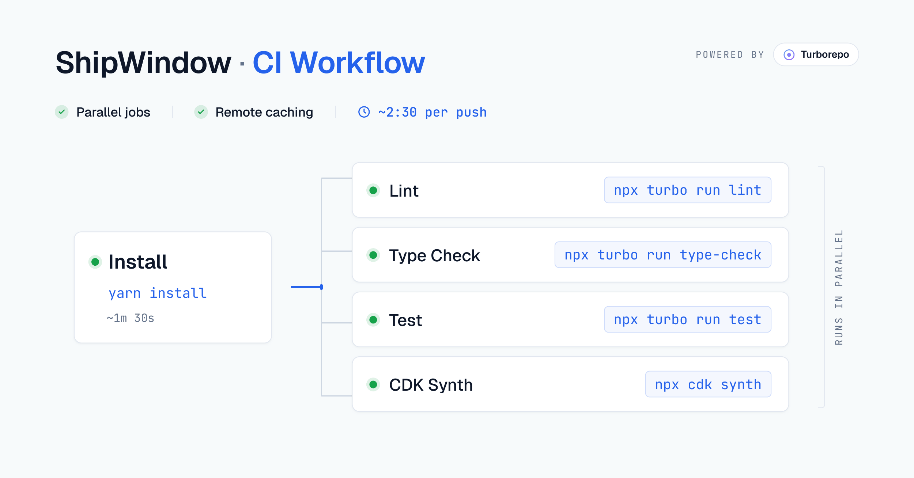

I've been building [ShipWindow](https://shipwindow.dev/) for a few months now — _deliberately slowly, with a production mindset from day one._ No users yet, but real architecture, real CI, infrastructure-as-code.

"Ship fast, refactor later" might be the usual call for a side project like this. But I wanted to try balancing it with a production mindset as I went — _still shipping, but thinking a bit further ahead while I did._

The result has been a mix. Some of the production-minded choices have paid off — the CI work I'm about to walk through is one of them. This post is mostly about the part that paid off.

CI is where that mindset showed up early. When the project was in its early phase, I had a minimal workflow validating each PR — _lint, type-check, and tests_ running one after another, sequentially. It was fine for the time. But as the project grew, so did the workflow. As of writing this, the same CI runs across _3 apps and 4 packages in around 2 minutes 30 seconds on most pushes_ — and it's set up to scale with the project rather than slow down as more code lands.

Three apps, a few shared packages, every push rebuilding everything. You'd expect CI to be slow on a setup like this — that was certainly my starting point. It turned out it doesn't have to be, and _the confidence that gives me when merging changes across stacks is honestly the bigger win._ I'll walk through how it works, and the decisions that got it there.



## The shape of the repo

The high-level structure of the repo looks like this:

```bash:title=Directory_Structure&noCopy
shipwindow/
├── apps/
│   ├── web/          # Next.js 16 — authenticated dashboard
│   ├── site/         # Next.js 16 — landing page
│   └── api/          # NestJS — webhook ingestion + auth
├── packages/
│   ├── ui/           # Shared component library (Tailwind v4)
│   ├── shared-types/ # Types shared web ↔ api
│   ├── eslint-config/
│   └── typescript-config/
├── infra/            # AWS CDK stacks
├── turbo.json        # Task graph + cache config
└── package.json      # Yarn workspaces declaration
```

Three apps live under `apps/` — each one is something that gets deployed independently. Four shared packages live under `packages/` — these are libraries the apps import from, but nothing ships them on their own. Infrastructure lives in `infra/`, kept separate from the application code because it has its own lifecycle and tooling.

[Yarn workspaces](https://yarnpkg.com/features/workspaces) stitch the whole thing together as one repo — when `apps/web` imports `@shipwindow/ui`, it resolves to the local source directly, no publish step in between. [Turborepo](https://turborepo.dev/) sits on top of workspaces and orchestrates the task running — knowing what to build in what order, what to cache, and what to skip.

## Why a monorepo

When I started thinking about ShipWindow's setup, my first instinct was actually to split into multiple repos. It felt safer — less tooling to figure out, less to think about on day one. I'd worked in a monorepo before and knew the upfront cost: the first few weeks of "what goes where" decisions, the conventions to enforce on a project.

But eventually I was willing to invest that time upfront, knowing it would pay off as the project grew. A few things pushed me in that direction.

_Past experience._ I'd worked in a monorepo on a previous project and it had served me well. I also remembered the alternative — publish a package, bump the version, install, redeploy, every time anything shared changed. Not something I wanted to live through again on a side project where I wanted to move fast without the overhead of versioning and publishing.

_Atomic refactors._ Shipping solo, I wanted to move quickly without juggling contracts across repos. When I add a new field to a type in `packages/shared-types`, both `apps/web` and `apps/api` get the change in the same PR. No version bump, no broken contracts in production. One PR, done.

_One review, one diff._ Every change shows up against the full picture. If a frontend change needs an API endpoint, both land in the same PR — the contract is visible in one diff, not split across two repos with two CI runs.

_Shared design tokens stay in sync._ `packages/ui` exports brand colors, components, and CSS tokens. The day I rebrand and edit `brand.css`, every app updates on the next build. No copy-paste, no drift.

Working in a monorepo, _the honest cost is discipline_. Without it, everything starts depending on everything, and you stop knowing what's safe to change. I've worked on a monorepo project before, and it's a pattern I've seen play out — especially if you haven't worked in one before and are still getting your head around it. The discipline lives in being deliberate about what belongs in a shared package versus what stays in an app, and honest about what each package is actually responsible for.

## Why Turborepo

Once I'd decided on a monorepo, the next question was how to actually run things across it. Yarn workspaces handles the dependency graph — when `apps/web` imports `@shipwindow/ui`, it resolves to the local source without any publish step. That part is solved.

But workspaces alone doesn't handle task orchestration — what to build first, what to cache, what to skip. For that, build tools like Lerna, Nx, or Turborepo are generally used. They sit on top of workspaces, not in place of them — you use both.

[Turborepo](https://turborepo.dev/) describes itself as _"the build system for JavaScript and TypeScript codebases"_ — and it's maintained by Vercel, which matters here because _their free remote cache_ is one of the reasons I picked it. It's written in Rust, configured through a single `turbo.json` file, and built around the task graph and caching model that most monorepo tools have converged on.

On a previous project, I worked in a monorepo that used Lerna. I didn't pick it — the project had been set up before I joined — but I lived with it long enough to get a feel for it. Lerna was widely used for JS monorepos at the time.

Turborepo is newer and its ecosystem is still growing, but its focus is squarely on builds and caching — which, for a side project where I don't publish anything externally but care a lot about CI speed, lined up better with what I needed.

<InfoCallToAction>

Turborepo's [Crafting your repository](https://turborepo.dev/docs/crafting-your-repository) docs cover structuring a monorepo, managing dependencies, configuring tasks, caching, and more — in real depth. Start there if you're setting up your first one.

</InfoCallToAction>

## The apps and packages

- **`apps/web`** — authenticated dashboard, [Next.js 16](https://nextjs.org/) App Router
- **`apps/site`** — landing page, statically rendered except for one server action
- **`apps/api`** — [NestJS](https://nestjs.com/) backend, ingests GitHub webhooks, hosts auth endpoints

Each app runs on a different port in dev, deploys to a different platform, and has its own scaling profile.

- **`packages/ui`** — shared component library, consumed directly from source by both Next.js apps
- **`packages/shared-types`** — single source of truth for the wire shape between web and api: `WebhookEvent`, `PullRequest`, `Review`, etc.
- **`packages/eslint-config`** and **`packages/typescript-config`** — shared lint and TS configs; apps extend these so the rules stay consistent

None of the packages have a publish step. They're consumed through the workspace graph at build time — which is the whole point of using workspaces in the first place.

## How Turborepo orchestrates everything

Turborepo's job is to figure out _what work needs doing, in what order, and what can be skipped_. It does all of that based on a single config file at the root of your repo: `turbo.json`.

`turbo.json` is where you describe the task graph — what tasks exist, what they depend on, what their inputs and outputs are. Here's a trimmed version of mine:

```json:title=turbo.json
{
  "tasks": {
    "build": {
      "dependsOn": ["^build"],
      "inputs": ["$TURBO_DEFAULT$", ".env*"],
      "outputs": [".next/**", "!.next/cache/**", "dist/**", "generated/**"],
      "env": ["DATABASE_URL", "NEXT_PUBLIC_BACKEND_URL"]
    },
    "lint": {
      "dependsOn": ["^build"],
      "env": ["CI", "RESEND_API_KEY", "VERCEL_ENV"]
    },
    "dev": {
      "cache": false,
      "persistent": true
    }
  }
}
```

A few things in here are doing most of the work:

_`dependsOn: ["^build"]`_ — the caret means "build all upstream packages first." So when I run `turbo run build` in `apps/web`, Turbo first builds `packages/ui` and `packages/shared-types`, then `apps/web` itself. I never order tasks manually. Turbo walks the workspace graph for me.

_The `env` array_ — this is the easy one to get wrong. Any environment variable a task reads but doesn't declare here gets silently ignored when Turbo computes the cache key.

This env array was something that troubled me initially. The cache had quietly lied to me more than once before I understood what was happening — CI coming back green when it shouldn't have, stale results being served without anything flagging it.

_The fix:_ list every env var your task actually reads to make a cache reliable and predictable.

## Running apps locally

To run every app, it's one command:

```bash
yarn dev                # all apps in parallel
yarn dev --filter=web   # just one
```

The hot reload across packages is what makes the monorepo feel worth it day to day. Change a button in `packages/ui`, and the apps using it update immediately — no build step, no `npm link`, no publish. _It just works._

Under the hood, Yarn workspaces points each app at the package's actual folder on disk rather than a copy. So edits in `packages/ui` count the same as edits inside the app — the dev server picks them up like any other file change.

If you've worked in a multi-repo setup before, this is the part that quietly justifies the rest of the complexity.

## What this looks like in CI: parallelism and caching

Three apps, four packages, lint and type-check and tests on every push. Initially, my CI ran these sequentially — that's just how I'd set it up. While I was just starting out and in the early phase of adding features, it didn't matter much. The project was small, and sequential was simpler to reason about.

The shift to parallel jobs wasn't _really about speed._ Sequential CI was still fast enough at three apps and a handful of tests. The real reason was headroom for later: as features and tests grow, sequential adds up. Splitting tasks into parallel jobs also keeps the workflow predictable, and lets Turborepo handle the actual task ordering inside each one. That's cleaner than chaining steps in YAML and hoping the order holds.

In practice, that means lint, type-check, tests, and cdk synth are each their own [GitHub Actions](https://docs.github.com/en/actions) job, depending on a shared install step. Once install finishes, all four run in parallel.


The four jobs after install all run side by side, so the pipeline finishes in roughly the time of the longest job, not the sum.

Inside each of those jobs is where Turborepo does its work. In my setup, lint, type-check, and tests all `dependsOn: ["^build"]` — meaning each of them needs the upstream packages built before it can run. I don't have to think about that. Turborepo walks the task graph, builds whatever's needed (or pulls it from the cache if it's already built), then runs lint, type-check, and tests on top. **It figures out the right order so I don't have to script it.**

On the **caching side**, that's where the actual savings come from. Turborepo tracks each task's inputs — source files, env vars, dependencies — and skips work it's seen before with identical inputs. The [Vercel Remote Cache](https://vercel.com/docs/monorepos/remote-caching) makes this work across CI. Setup is two environment variables in your workflow: `TURBO_TOKEN` (a Vercel access token) and `TURBO_TEAM` (your team slug). When `npx turbo run <task>` runs, Turbo reads those env vars from the environment and connects to the remote cache automatically. No other config needed.

Here's what one of the parallel jobs looks like in my workflow — the lint job, for example:

```yaml:title=.github/workflows/pr-validate.yml
# ... yarn install job...

lint:
  name: Lint
  needs: install
  runs-on: ubuntu-latest
  env:
    TURBO_TOKEN: ${{ secrets.TURBO_TOKEN }}
    TURBO_TEAM: ${{ vars.TURBO_TEAM }}
  steps:
    - uses: actions/checkout@v4

    - uses: actions/setup-node@v4
      with:
        node-version: 24

    - run: npx turbo run lint

# ... type-check, test and cdk-synth jobs ...
```

The structure is the same for each parallel job — `needs: install`, then run a single Turbo task. The `TURBO_TOKEN` and `TURBO_TEAM` env vars are what let Turbo talk to the remote cache; without them, the job would run everything from scratch.

For a typical PR in ShipWindow — say I add a new type `GithubEvent` in `packages/shared-types` and update `apps/web` to render it — Turborepo realizes `apps/site` isn't affected. Its build is already cached, its lint result is already cached, its tests haven't changed. So those get pulled from the cache instead of being rerun. **Only the work that actually changed runs.**

For a solo project, the cache is already paying off — I can see most PRs hitting at least some cached tasks. With more contributors, the win gets bigger: builds run for one person's PR can be reused on someone else's, so the same work doesn't happen twice. Turborepo's job is to skip work that doesn't need redoing and to handle task order. GitHub Actions runs the jobs in parallel. Together, the CI stays relatively quick.

## What I'd improve

One thing on the list for later: **affected-only builds with [`--filter`](https://turborepo.dev/docs/reference/run#--filter-string).** Turborepo supports running tasks only for the workspaces affected by changed files — `turbo run build --filter=...^...` skips unaffected workspaces entirely instead of having Turbo do a cache lookup on each one.

I'd be happy to explore it as the project grows. For now, caching is doing the heavy lifting and the savings would be marginal — it earns its place once the workspace is big enough that even the lookups start to add up.

## What I learned

Most of what I've described here is roughly what I believe most Turborepo projects converge on. The patterns aren't novel — they just take a while to feel obvious.

The bigger thing I'm taking from a few months of this: **the engineering decisions that matter on a side project aren't really about being objectively right.** They're about giving yourself room to keep going — and to keep improving as you do. Monorepo over multi-repo, Turborepo over rolling my own scripts, caching over hoping CI stays fast — none of these are universal answers. They were the ones that kept me building features instead of fighting tooling.

If you're curious what I'm building, take a look at [ShipWindow](https://shipwindow.dev/). Still pre-launch, waitlist's open if you want to be one of the first to try it.
