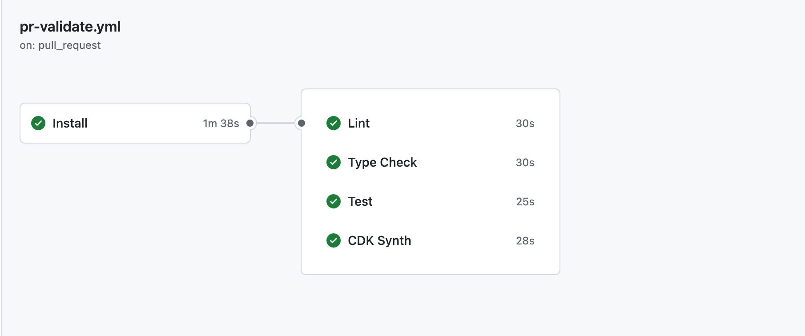

I've been building [ShipWindow](https://shipwindow.dev/) for a few months now — deliberately slowly, with a production mindset from day one. No users yet, but real architecture, real CI, infrastructure-as-code. The kind of setup I'd want to inherit, not the kind I'd want to apologize for. I am taking time with this project, partly because I want to learn from the parts.

When the project was in its early phase, I had a minimal CI workflow validating each PR — lint, type-check, and tests running one after another, sequentially. It was fine for the time, when there weren't many features moving through it. But as the project grew, so did the workflow. As of writing this, the same CI runs across 3 apps and 4 packages in under 2 minutes 30 seconds for typical pushes — and the setup is built to handle more as the project grows.

Three apps, a few shared packages, every push rebuilding everything. You might think CI would be slow on a setup like this. It isn't — and the confidence that gives me when merging changes across stacks is honestly the bigger win. I'll walk through the adjustments I made along the way.

## The shape of the repo

```bash:title=Directory_Structure&noCopy
shipwindow/
├── apps/
│   ├── web/          # Next.js 16 — authenticated dashboard
│   ├── site/         # Next.js 16 — marketing site
│   └── api/          # NestJS — webhook ingestion + auth
├── packages/
│   ├── ui/           # Shared component library (Tailwind v4)
│   ├── shared-types/ # Types shared web ↔ api
│   ├── eslint-config/
│   └── typescript-config/
├── infra/            # AWS CDK stacks
├── turbo.json        # Task graph + cache config
└── package.json      # Yarn workspaces declaration
```

Three apps live under `apps/` — each one is something that gets deployed independently. Four shared packages live under `packages/` — these are libraries the apps import from, but nothing ships them on their own. Infrastructure lives in `infra/`, kept separate from the application code because it has its own lifecycle and tooling.

Yarn workspaces stitch the whole thing together as one repo — when `apps/web` imports `@shipwindow/ui`, it resolves to the local source directly, no publish step in between. Turborepo sits on top of workspaces and orchestrates the task running — knowing what to build in what order, what to cache, and what to skip.

## Why a monorepo

Before starting ShipWindow, I went back and forth on this for a bit. Splitting into multiple repos was the obvious option, especially for a solo project — less initial tooling to set up, less to think about on day one. But I was willing to invest some upfront time on the monorepo setup, knowing it'd pay off as the project grew. A few things pushed me in that direction.

**Past experience.** I'd worked in a monorepo on a previous project and it had served me well. I also remembered the alternative — publish a package, bump the version, install, redeploy, every time anything shared changed. Not something I wanted to live through again on a side project.

**Atomic refactors.** Shipping solo, I wanted to move quickly without juggling contracts across repos. When I add a new field to a type in `packages/shared-types`, both `apps/web` and `apps/api` get the change in the same PR. No version bump, no broken contracts in production. One PR, done.

**One review, one diff.** Every change shows up against the full picture. If a frontend change needs an API endpoint, both land in the same PR — the contract is visible in one diff, not split across two repos with two CI runs.

**Shared design tokens stay in sync.** `packages/ui` exports brand colors, components, and CSS tokens. The day I rebrand and edit `brand.css`, every app updates on the next build. No copy-paste, no drift.

Working in a monorepo, the honest cost is discipline. Without it, everything starts depending on everything, and you stop knowing what's safe to change. I've worked on a monorepo project before, and it's a pattern I've seen play out — especially if you haven't worked in one before and are still getting your head around it. The discipline lives in being deliberate about what belongs in a shared package versus what stays in an app, and honest about what each package is actually responsible for.

### Why Turborepo?

Once I'd decided on a monorepo, the next question was how to actually run things across it. Yarn workspaces handles the dependency graph — when `apps/web` imports `@shipwindow/ui`, it resolves to the local source without any publish step. That part is solved.

But workspaces alone doesn't handle task orchestration — what to build first, what to cache, what to skip. For that, build tools like Lerna, Nx, or Turborepo are generally used. They sit on top of workspaces, not in place of them — you use both.

[Turborepo](https://turborepo.dev/) describes itself as _"the build system for JavaScript and TypeScript codebases"_ — and it's maintained by Vercel, which matters here because their free remote cache is one of the reasons I picked it. It's written in Rust, configured through a single `turbo.json` file, and built around the task graph and caching model that most monorepo tools have converged on.

On a previous project, I worked in a monorepo that used Lerna. I didn't pick it — the project had been set up before I joined — but I lived with it long enough to get a feel for it. I believe Lerna was the default standard for JS monorepos at the time.

Turborepo is newer and its ecosystem is still growing, but its focus is squarely on builds and caching — which, for a side project where I don't publish anything externally but care a lot about CI speed, lined up better with what I needed.

<InfoCallToAction>

Turborepo's [Crafting your repository](https://turborepo.dev/docs/crafting-your-repository) docs cover structuring a monorepo, managing dependencies, configuring tasks, caching, and more — in real depth. Start there if you're setting up your first one.

</InfoCallToAction>

## The apps and packages

`apps/web` is the authenticated dashboard. `apps/site` is the marketing page, statically rendered except for one server action. `apps/api` is the NestJS backend that ingests GitHub webhooks and hosts the auth endpoints. They run on different ports in dev, deploy to different platforms, and have different scaling profiles.

`packages/ui` is the shared component library, consumed directly from source by both Next.js apps. `packages/shared-types` is the single source of truth for the wire shape between web and api — types like `WebhookEvent`, `PullRequest`, `Review`. The two config packages (`eslint-config`, `typescript-config`) are exactly what they sound like — apps extend them so the rules stay consistent.

None of the packages have a publish step. They're consumed through the workspace graph at build time, which is the whole point of using workspaces in the first place.

## How Turborepo orchestrates everything

Turborepo's job is to figure out what work needs doing, in what order, and what can be skipped. It does all of that based on a single config file at the root of your repo: `turbo.json`.

`turbo.json` is where you describe the task graph — what tasks exist, what they depend on, what their inputs and outputs are. Here's a trimmed version of mine:

```json:title=turbo.json
{
  "tasks": {
    "build": {
      "dependsOn": ["^build"],
      "inputs": ["$TURBO_DEFAULT$", ".env*"],
      "outputs": [".next/**", "!.next/cache/**", "dist/**", "generated/**"],
      "env": ["DATABASE_URL", "NEXT_PUBLIC_BACKEND_URL"]
    },
    "lint": {
      "dependsOn": ["^build"],
      "env": ["CI", "RESEND_API_KEY", "VERCEL_ENV"]
    },
    "dev": {
      "cache": false,
      "persistent": true
    }
  }
}
```

A few things I would like to call out here:

The `dependsOn: ["^build"]` line is what makes the build graph work. The caret means "build all upstream packages first." So when I run `turbo run build` in `apps/web`, Turbo first builds `packages/ui` and `packages/shared-types`, then `apps/web` itself. I never order tasks manually; Turbo walks the workspace graph for me.

The `env` array is the part that took me a couple of evenings to figure out. Any environment variable a task reads but doesn't declare here gets silently ignored when Turbo computes the cache key. That doesn't sound dangerous until you realize what it means — your cache can return stale results that were generated under a different env, and you have no idea why your tests are passing when they shouldn't be. The first time it happened to me, I spent way too long staring at a green CI run that should've been red.

The fix is: list every env var your task actually reads. There's no shortcut. But once you've done it, the cache becomes reliable, and reliability is the whole reason you'd use a remote cache in CI.

### Running apps locally

To run every app, it's a one command:

```bash
yarn dev                # all apps in parallel
yarn dev --filter=web   # just one
```

Out of many awesome things, the hot reload across packages makes the setup even worth for day to day. When I change a button in `packages/ui` and the apps using it update immediately — no build step, no `npm link`, no publish. It just works.

The way it works is simpler than it sounds. Yarn workspaces makes the shared package look like a normal `node_modules` dependency to each app — except instead of being a downloaded copy, it's a shortcut pointing back to the real folder on disk. So when the dev server is watching for file changes, edits in `packages/ui` count the same as edits inside the app itself. The dev server reloads, Tailwind picks up any new CSS classes, and TypeScript shows any new types — all without me having to do anything.

## What this looks like in CI: parallelism and caching

Three apps, four packages, lint and type-check and tests on every push. Initially, my CI ran these sequentially — that's just how I'd set it up. With a small project it didn't matter, and sequential was simpler to start with.

That changed as the project grew. Each new test, each new lint rule, each new package added to the total. Sequential adds up fast even when each step is short — so I restructured the CI to run independent tasks in parallel. With the project still growing, with more features, test cases, I believe running in parallel would help me scale this.

The parallelism comes from how the GitHub Actions workflow is structured: lint, type-check, tests, and `cdk synth` are each their own job, all depending on a shared install step. Once install finishes, GitHub Actions spins up four parallel runners and runs them concurrently.



Install runs first (1m 38s), then Lint, Type Check, Test, and CDK Synth all run in parallel — finishing in 25-30 seconds each. The whole pipeline finishes in around 2:30 instead of summing to 4-plus minutes.

Inside each of those jobs is where Turborepo does its work. In my setup, lint, type-check, and tests all `dependsOn: ["^build"]` — meaning each of them needs the upstream packages built before it can run. I don't have to think about that. Turborepo walks the task graph, builds whatever's needed (or pulls it from the cache if it's already built), then runs lint, type-check, and tests on top. It figures out the right order so I don't have to script it.

So talking about caching side, it's where the actual savings come from. Turborepo tracks each task's inputs — source files, env vars, dependencies — and skips work it's seen before with identical inputs. The [Vercel Remote Cache](https://vercel.com/docs/monorepos/remote-caching) (free on all plans) makes this work across CI. Setup is two env vars in your workflow: `TURBO_TOKEN` (a Vercel access token) and `TURBO_TEAM` (your team slug). Turbo picks them up automatically and uses the remote backend — no other config needed.

Here's what one of the parallel jobs looks like in my workflow — the lint job, for example:

```yaml:title=.github/workflows/pr-validate.yml
# ... yarn install job...

lint:
  name: Lint
  needs: install
  runs-on: ubuntu-latest
  env:
    TURBO_TOKEN: ${{ secrets.TURBO_TOKEN }}
    TURBO_TEAM: ${{ vars.TURBO_TEAM }}
  steps:
    - uses: actions/checkout@v4

    - uses: actions/setup-node@v4
      with:
        node-version: 24

    - run: npx turbo run lint

# ... type-check, test and cdk-synth jobs ...
```

The structure is the same for each parallel job — `needs: install`, then run a single Turbo task. The `TURBO_TOKEN` and `TURBO_TEAM` env vars are what let Turbo talk to the remote cache; without them, the job would run everything from scratch.

For a typical PR in ShipWindow — say I add a field to `PullRequest` in `packages/shared-types` and update `apps/web` to render it — Turborepo realizes `apps/site` isn't affected. Its build is already cached, its lint result is already cached, its tests haven't changed. So those get pulled from the cache instead of being rerun. Only the work that actually changed runs.

Cold builds — no cache, like after a dependency upgrade — run around 8 minutes. The 2:30 is what happens when the cache works, which is most of the time. The honest framing: Turborepo's job is to make sure no work is redone unnecessarily, and to figure out what order things need to happen in. GitHub Actions provides the parallel runners. Together, that's where the 2:30 comes from.

## What I'd improve

One thing on my list for when the project grows enough to need it.

**Affected-only builds with `--filter`.** Turborepo supports running tasks only for the workspaces affected by changed files — `turbo run build --filter=...^...` skips unaffected workspaces entirely, instead of letting them go through a cache lookup. It's something I'd be happy to explore as the project grows. For now, CI is relatively quick thanks to caching, and the current setup feels like a good balance. The extra config complexity isn't worth it yet, but it's the next lever to pull when the project starts to outgrow what caching alone can handle.
